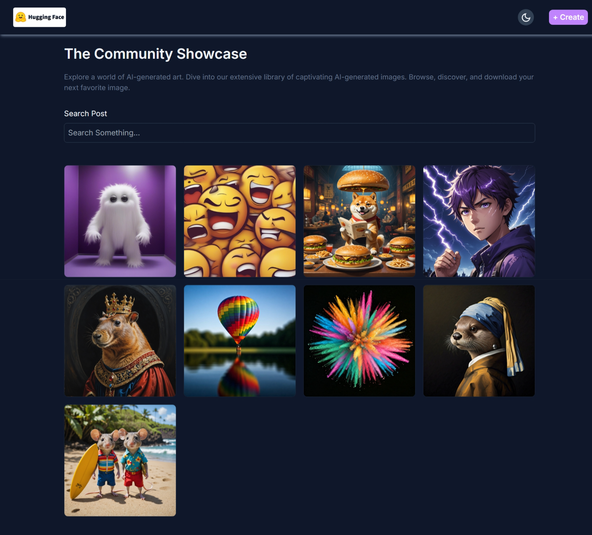
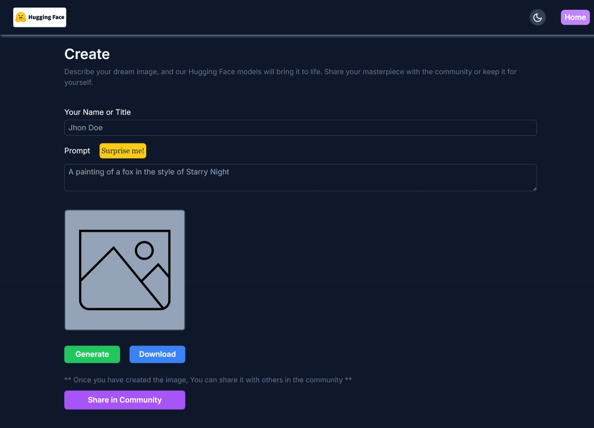

<div id="readme-top" align="center">

  <h1>AI Image Hive</h1>

  <p>An AI-powered image generation & sharing platform.</p>

  <p><a href="https://image-generator-tazg.onrender.com">View site</a></p>

</div>

<p align="center">This application is built using the MERN stack. Initially, DALL-E AI was considered for image generation, but due to limitations in the free tier, the project switched to open-source models. Images are generated using open-source text-to-image models available at https://huggingface.co. The serverless API allows up to 1000 free requests per day (higher limits are available with a subscription).</p>

<br />

> **Note:** This site may or not be available at the moment due to the free tier limits of the Hugging Face API. If you encounter issues, please try again later or check the [Hugging Face API](https://huggingface.co) for more information.


<!-- Table of Contents -->
# :notebook_with_decorative_cover: Table of Contents

- [:star2: About the Project](#star2-about-the-project)
  - [:camera: Screenshots](#camera-screenshots)
  - [:space\_invader: Tech Stack](#space_invader-tech-stack)
  - [:dart: Features](#dart-features)
  - [:key: Environment Variables](#key-environment-variables)
- [:toolbox: Getting Started](#toolbox-getting-started)
  - [:bangbang: Prerequisites](#bangbang-prerequisites)
  - [:gear: Installation](#gear-installation)
  - [Windows Users: Handling NODE\_ENV Issues](#windows-users-handling-node_env-issues)
  - [:running: Run Locally](#running-run-locally)
- [:wave: Contributing](#wave-contributing)
  - [Top contributors:](#top-contributors)
- [:grey\_question: FAQ](#grey_question-faq)
- [:warning: License](#warning-license)
- [:handshake: Contact](#handshake-contact)
- [:gem: Acknowledgements](#gem-acknowledgements)

<!-- can't wrap the table of contents because of some auto formatting issue in VSCode
# :notebook_with_decorative_cover: Table of Contents

- [About the Project](#star2-about-the-project)
  - [Screenshots](#camera-screenshots)
  - [Tech Stack](#space_invader-tech-stack)
  - [Features](#dart-features)
  - [Environment Variables](#key-environment-variables)
- [Getting Started](#toolbox-getting-started)
  - [Prerequisites](#bangbang-prerequisites)
  - [Installation](#gear-installation)
  - [Run Locally](#running-run-locally)
- [TODOs \& Planned Features](#memo-todos--planned-features)
- [Contributing](#wave-contributing)
  - [Top contributors:](#medal_sports-top-contributors)
- [FAQ](#grey_question-faq)
- [License](#warning-license)
- [Contact](#handshake-contact)
- [External Tools \& Libraries](#package-external-tools--libraries)
- [Acknowledgements](#gem-acknowledgements)

 -->


<!-- About the Project -->
## :star2: About the Project


<!-- Screenshots -->
### :camera: Screenshots

<div align="center" style="margin-bottom: 80px;">
  <div style="margin-bottom: 40px;">
    <h3>Home Page</h3>
    
    <h3>Create Page</h3>
    
  </div>
</div>


<!-- TechStack -->
### :space_invader: Tech Stack

| Platform       | Technologies Used                                |
|----------------|--------------------------------------------------|
| Frontend       | React.js, Tailwind CSS                           |
| Backend        | Node.js, Express                                 |
| Database       | MongoDB                                          |
| Other Services | Cloudinary, Hugging Face (API)                   |


<!-- Features -->
### :dart: Features

- Image generation using open-source models from Hugging Face
- Image upload and sharing functionality
- Responsive design for mobile and desktop

<!-- Env Variables -->
### :key: Environment Variables

To run this project, you will need to add the following environment variables to your .env file

```env
MONGO_URI=
HUGGINGFACE_API_KEY=
CLOUD_NAME=
CLOUD_API_KEY=
CLOUD_API_SECRET=
PORT=
```

<!-- Getting Started -->
## 	:toolbox: Getting Started

<!-- Prerequisites -->
### :bangbang: Prerequisites

- Node.js
- Git

<!-- Installation -->
### :gear: Installation
To install and set up the project locally, follow these steps:

1. **Clone the repository:**
  ```bash
  git clone https://github.com/Adhik-6/image_generator.git
  cd image_generator
  ```

2. **Install server dependencies:**
  ```bash
  npm install
  ```

3. **Install client dependencies:**
  ```bash
  cd client
  npm install
  cd ..
  ```

4. **Set up environment variables:**  
  Create a `.env` file in the root directory and add the required variables as described above.

The application should now be running locally.


### Windows Users: Handling NODE_ENV Issues

If you encounter the error:  
`'NODE_ENV' is not recognized as an internal or external command, operable program or batch file.`

- Update the `scripts` section in your `package.json` as follows:
  ```json
  // For testing production locally (not for deployment)
  "scripts": {
   "start": "SET NODE_ENV=production && node server/index.js",
   "build": "npm install && npm install --prefix client && npm run build --prefix client",
   "start:server": "SET NODE_ENV=development && nodemon ./server/index.js",
   "test": "echo \"Error: no test specified\" && exit 1"
  }
  ```

- In `./server/index.js`, replace line 27 with:
  ```js
  if (process.env.NODE_ENV === "production ") {
  ```
  > **Note:** The trailing space after `"production "` is intentional. When using the `SET` keyword in Windows, the space is included in the environment variable value.

This adjustment is necessary because Windows requires the `SET` keyword to define environment variables, and it may include trailing spaces.

   
<!-- Run Locally -->
### :running: Run Locally

1. **Build the client:**
  ```bash
  npm run dev --prefix client
  ```

2. **Start the server:**
  ```bash
  npm run dev
  ```

<!-- CONTRIBUTING -->
## :wave: Contributing

Contributions are what make the open source community such an amazing place to learn, inspire, and create. Any contributions you make are **greatly appreciated**.

If you have a suggestion that would make this better, please fork the repo and create a pull request. You can also simply open an issue with the tag "enhancement".
Don't forget to give the project a star! Thanks again!

1. Fork the Project
2. Create your Feature Branch (`git checkout -b feature/AmazingFeature`)
3. Commit your Changes (`git commit -m 'Add some AmazingFeature'`)
4. Push to the Branch (`git push origin feature/AmazingFeature`)
5. Open a Pull Request


### Top contributors:

<a href="https://github.com/Adhik-6/Event_Hubzz/graphs/contributors">
  
</a>


<!-- FAQ -->
## :grey_question: FAQ

- **Why do I get an error about 'NODE_ENV' on Windows?**

  + Windows handles environment variables differently. See the "Windows Users: Handling NODE_ENV Issues" section above for a workaround.

- **Where are the generated images stored?**

  + Images are uploaded and stored using [Cloudinary](https://cloudinary.com).

- **Can I deploy this project to my own server?**

  + Yes, you can deploy it to your own server or cloud provider. Make sure to configure environment variables and dependencies as needed.

- **What should I do if the live site is unavailable?**

  + The site may be down due to free tier limits on the Hugging Face API. Try again later.


<!-- License -->
## :warning: License

Distributed under the no License. See LICENSE.txt for more information.


<!-- Contact -->
## :handshake: Contact

Adhik - adhik.m10a@gmail.com


<!-- Acknowledgments -->
## :gem: Acknowledgements

Use this section to mention useful resources and libraries that you have used in your projects.

 - [Tailwind CSS](https://tailwindcss.com) - For styling the frontend
 - [Cloudinary](https://cloudinary.com) - For image upload and storage
 - [Hugging Face](https://huggingface.co) - For providing the API for image generation


<p align="right">(<a href="#readme-top">back to top</a>)</p>
